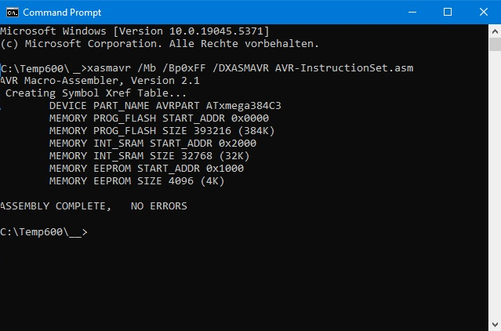

# haXASM

Assembler for AVR, MC6800, MC68HC05 and UPI-C42    

This is an example of a step-by-step implementation of a Macro Cross-Assembler  
with if-else-endif preprocessor directives running under Windows console.  
The instruction set of any other microcontroller can be easily added.            
Four different assemblers are currently available:

##### XASM8042

*Cross-Assembler for Intel MCS-48, 8042, UPI-C42*

##### XASM6802

*Macro-Assembler for Motorola MC6800/6802*

##### XASM6805

*Macro-Assembler for Motorola MC68HC05 (all types)*
 
# XASMAVR (new)

***Macro Assember for the Atmel AVR<sup>(R)</sup> Microcontroller family***  

RELEASE NOTICE  
First release: XASMAVR Version 2.1 October 2024

  

#### Build
 
haXASM project sources `*.cpp` are written in explicit 'C',  
observing the syntax of the MS C++ Compiler.  
In order to gain an educational effect, extensive "pointerism"  
as well as any complex structure constructs have been intentionally avoided.  
The sources are tabulated 3 5 7.. and are decently commented to show the "where and how".   
Some redundancies were implemented to enhance understanding of certain functionality.    

To build the haXASM executables as 32bit-Versions for Windows XP, Vista, Windows 10, 11, ..   
all `*.cpp, *h, *nmk` files reside in the folder `c:\temp600\__\*.*`,   
and are compiled within the *Visual Studio 2010 Developer Command Prompt*:  

```bld32bit
Setting environment for using Microsoft Visual Studio 2010 x86 tools.      
C:\Program Files (x86)\Microsoft Visual Studio 10.0\VC>NMAKE c:\temp600\__\haXASM.nmk /all 
```

The [build process](build/VS2010build32.jpg) generates four different 32bit-Versions of haXASM:
-	XASM8042.exe... Cross-Assembler for Intel MCS-48, 8042, UPI-C42
-	XASM6800.exe... Macro-Assembler for Motorala MC6800/6802
-	XASM6805.exe... Macro-Assembler for Motorola MC68HC05 (all types)
-	XASMAVR.exe....  Macro-Assembler for Atmel/Microchip AVR<sup>(R)</sup> devices instruction set

... see the Nmake-script `source/haXASM.NMK` for details.

Note: When compiled with *MS Visual Studio 2019*, the executables will no longer run under Windows XP.  
      To build and run the haXASM project under another OS, some adaptations may be required.

The [build process](build/VS2010build64.jpg) automatically generates 64bit-Versions of haXASM when invoked under:

```bld64bit
**********************************************************************    
** Visual Studio 2019 Developer Command Prompt v16.8.4    
** Copyright (c) 2020 Microsoft Corporation    
**********************************************************************    
[vcvarsall.bat] Environment initialized for: 'x64'  
C:\Program Files (x86)\Microsoft Visual Studio\2019\Community>NMAKE c:\temp600\__\haXASM.nmk /all
```
... see the Nmake-script `source/haXASM.NMK` for details.

#### XASMAVR special Features

The XASMAVR Macro Assembler runs under Windows<sup>(R)</sup> and generates fix code  
for the Atmel/Microchip AVR<sup>(R)</sup> microcontroller family.  
XASMAVR.exe is the newest variant of haXASM.

XASMAVR V2.1 implements most of the features described in the following document:  
*.Microchip AVR<sup>(R)</sup> Assembler*  
*.(c)2017 Microchip Technology Inc. User Guide DS40001917A*

To assemble an AVR<sup>(R)</sup> source file, run `XASMAVR myavrproj.ASM`.  
You will end up with a listing `myavrproj.LST` of the source file,  
and with `myavrproj.HEX` / `myavrproj.EEP.HEX` in Intel HEX format.  
Optionally a Program-Flash image `myavrproj.BIN` can be generated.  
Common Object File Format (COFF), containing debugging information, is currently not generated.

With respect to the original Atmel assembler AVRASM2  
extra preprocessor directives have been added in XASMAVR:

- .MODEL BYTE................	byte addresses in listing  
- .MODEL WORD............     	word addresses in listing (default)  
- .MODEL NOINFO.........	suppress additional info on screen  
- .MODEL SYNTAX..........  	extended syntax check  

#### CSEG Byte or Word addresses in listing
Controling the rendition of the *.LST file
  1) show BYTE addresses in code segment, with instructions splitted into byte entities  
  Commandline: `XASMAVR /Mb`. In source use directive: `.MODEL BYTE`  
  2) show WORD addresses in code segment, where instructions are word entities  
  Commandline: `XASMAVR /Mw`. In source use directive: `.MODEL WORD`  
  Note: Listing byte addresses instead of word addresses sometimes can be very useful,  
        because of the direct correspondence with the layout in *.HEX files.  

Invoke `XASMAVR /?` for more commandline options:

``` hlp
AVR Macro-Assembler, Version 2.1  
XASMAVR [/options] srcfile.asm | srcfile.s  
  /Bp0xFF    Generate a .BIN-File with padding=0xFF for unused gaps  
  /Bp0x00    Generate a .BIN-File with padding=0x00 for unused gaps  
  /AmOFF     Suppress activity monitor display  
  /Mb        .MODEL BYTE: List byte addresses in code segment  
  /Mw        .MODEL WORD: List word addresses in code segment  
  /S         .SYMBOLS: Append symbol map in listing  
  /d         .DEVICE: List the supported AVR devices on console  
  /D<symbol> Define text symbol  
  Note: [/options] are case-sensitive.  
```

#### Listfile Formatting Directives
.MODEL BYTE ........................		CSEG Byte addresses in listing (special XASMAVR feature)  
.MODEL WORD ....................        	CSEG Word addresses in listing (default)  
.MODEL NOINFO..................     		Suppress some info displayed on console  
.TITLE text................................    	Title in page header  
.SUBTTL text............................       	Subtitle in page header  
.PAGELENGTH(number)......  			Lines per page   
.PAGEWIDTH(number) .......   			Colums per page  
.EJECT........................................      	New listing page ejected ('FormFeed')  
.SYMBOLS................................           	Symbol map appended in listing  
.NOSYMBOLS ........................          	Listing without symbol map (default)  
.NOLISTMACRO ...................         	Disable listing of macro expansion (default)  
.NOLISTMAC...........................         	Disable listing of macro expansion (default)  
.LISTMACRO............................          	Enable listing of macro expansion  
.LISTMAC..................................         	Enable listing of macro expansion  
.NOLIST.....................................	Suppress source lines in listing  
.LIST ...........................................	Show source lines in listing (default)  

see the [XASMAVR V2.1 - Reference Guide](XASMAVR%20V2.1%20-%20Reference%20Guide.pdf) for details


			    
